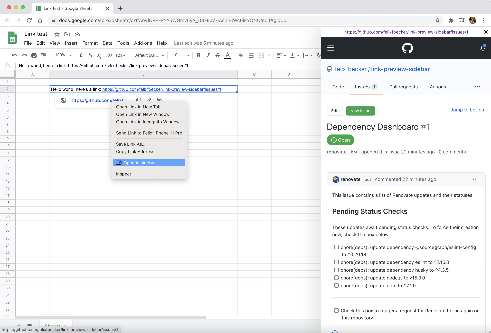

<h1>  Link Preview Sidebar Browser Extension</h1>

<!--  -->

Browser extension to open links in a sidebar instead of a new tab.

## Installation

Install the add-on for Firefox from the [Firefox webstore](https://addons.mozilla.org/en-US/firefox/addon/link-preview-sidebar/).

Install the extension for Chrome from the [Chrome store](https://chrome.google.com/webstore/detail/link-preview-sidebar/cdnefgebicfnnnjmbnlldhfjmcblfhob). (Or you can can download [the latest release from GitHub](https://github.com/felixfbecker/link-preview-sidebar/releases/latest) and sideload it.)

## Usage

There are two ways to open a link in the sidebar:

- Right click on a link and select "Open in sidebar"
- Hold the <kbd>Alt</kbd> key while clicking a link (<kbd>⌥</kbd> on macOS)

---

Icon made by <a href="https://www.flaticon.com/authors/kirill-kazachek" title="Kirill Kazachek">Kirill Kazachek</a> from <a href="https://www.flaticon.com/" title="Flaticon">www.flaticon.com</a>

